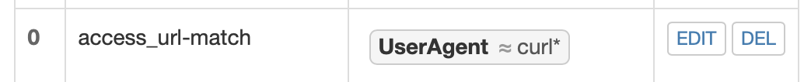

# 实验5
---
## 实验环境
---
* 虚拟机Ubuntu 20.0.04
* 主机环境
* Nginx
* VeryNginx
* Wordpress4.7
* DVWA
---
## 实验内容
---
### 实验要求
**基本要求**
- [x] 在⼀台主机（虚拟机）上同时配置Nginx和VeryNginx
    * VeryNginx作为本次实验的Web App的反向代理服务器和WAF
    * PHP-FPM进程的反向代理配置在nginx服务器上，VeryNginx服务器不直接配置Web站点服务
- [x] 使用Wordpress搭建的站点对外提供访问的地址为： http://wp.sec.cuc.edu.cn
- [x] 使用Damn Vulnerable Web Application (DVWA)搭建的站点对外提供访问的地址为：http://dvwa.sec.cuc.edu.cn

**安全加固要求**
- [x] 使⽤IP地址方式均无法访问上述任意站点，并向访客展示⾃定义的友好错误提示信息页面-1
- [x] Damn Vulnerable Web Application (DVWA)只允许白名单上的访客来源IP，其他来源的IP访问均向访客展示自定义的友好错误提示信息页面-2
- [x] 在不升级Wordpress版本的情况下，通过定制VeryNginx的访问控制策略规则，热修复WordPress < 4.7.1 - Username Enumeration
- [x] 通过配置VeryNginx的Filter规则实现对Damn Vulnerable Web Application (DVWA)的SQL注⼊实验在低安全等级条件下进行防护

**VeryNginx配置要求**
- [x] VeryNginx的Web管理页面仅允许⽩名单上的访客来源IP，其他来源的IP访问均向访客展示自定义的友好错误提示信息页面-3
- [x] 通过定制VeryNginx的访问控制策略规则实现：

    * 限制DVWA站点的单IP访问速率为每秒请求数 < 50
    * 限制Wordpress站点的单IP访问速率为每秒请求数 < 20
    * 超过访问频率限制的请求直接返回⾃定义错误提示信息页面-4
    * 禁止curl访问
---
## 实验步骤
---
### 配置环境
**修改主机hosts文件**
* 找到主机hosts文件
  ```bash
  sudo vim /etc/hosts
  ```
* 将如下信息添加进去
  ```bash
  192.168.56.101  vn.sec.cuc.edu.cn
  192.168.56.101  dvwa.sec.cuc.edu.cn
  192.168.56.101  wp.sec.cuc.edu.cn
  ```

**安装配置Nginx**
* 首先安装Nginx
  ```bash
  sudo apt install nginx
  ```
* 安装成功后进去到nginx目录，并修改配置文件的部分内容
  ```bash
  sudo vim /etc/nginx/sites-enabled/default
  ```
  ```bash
  root /var/www/html/wp.sec.cuc.edu.cn;
  # Add index.php to the list if you are using PHP

  index index.html index.php;
  
  location ~ \.php$ {
                include snippets/fastcgi-php.conf;
        #
        #       # With php-fpm (or other unix sockets):
                fastcgi_pass unix:/var/run/php/php7.4-fpm.sock;
                fastcgi_param SCRIPT_FILENAME $document_root$fastcgi_script_name;
                 include fastcgi_params;
        #       # With php-cgi (or other tcp sockets):
        #       fastcgi_pass 127.0.0.1:9000;
        }
  ```
  

* 为了防止安装verynginx后端口被占用，先使用`sudo nginx -s stop`停止监听

**安装配置VeryNginx**
* 按照[VeryNginx](https://github.com/alexazhou/VeryNginx/blob/master/readme_zh.md)文档的指示，安装Verynginx
  ```bash
  # 克隆VeryNginx仓库
  git clone https://github.com/alexazhou/VeryNginx.git
  
  sudo python3 install.py install
  ```

* 安装相关的依赖包
  ```bash
  # zlib
  sudo apt-get install zlib1g-dev
  # pcre
  sudo apt-get update
  sudo apt-get install libpcre3 libpcre3-dev
  # gcc
  sudo apt install gcc
  # make
  sudo apt install make
  # penssl library
  sudo apt install libssl-dev
  ```

* 修改VeryNginx配置文件
  ```bash
  sudo vim /opt/verynginx/openresty/nginx/conf/nginx.conf

  #修改用户名为www-data
  user www-data;
  ```
* 启动VeryNginx
  ```bash
  #Start Service
  /opt/verynginx/openresty/nginx/sbin/nginx
  ```

* 访问服务器8080端口
    
    输入默认的用户名和密码`verynginx`，登陆成功。

**安装php及相关组件**
  ```bash
  sudo apt install php-fpm php-mysql php-curl php-gd php-intl php-mbstring php-soap php�xml php-xmlrpc php-zip
  ```

**下载mysql**
* 下载mysql
  ```bash
  sudo apt-get install mysql
  ```
* 登陆mysql
  ```bash
  sudo mysql
  ```
* 创建相关的库并配置好相应的用户名及密码
  ```bash
  CREATE DATABASE wordpress DEFAULT CHARACTER SET utf8 COLLATE utf8_unicode_ci;
  
  #配置wordpress库用户名和密码
  create user 'jiji'@'localhost' identified by 'JiJi$20221207';

  # 授权
  grant all on wordpress.* to 'jiji'@'localhost';

  
  CREATE DATABASE dvwa DEFAULT CHARACTER SET utf8 COLLATE utf8_unicode_ci;

  #配置dvwa库用户名和密码
  CREATE USER 'dvwa'@'localhost' IDENTIFIED BY 'p@ssw0rd';

  # 授权
  GRANT ALL ON dvwa.* TO 'dvw'@'localhost';

  # 退出
  exit
  ```
**下载配置WordPress**
* 下载WordPress4.7版本
  ```bash
  sudo wget https://wordpress.org/wordpress-4.7.zip

  # 解压
  sudo apt install p7zip-full
  7z x wordpress-4.7.zip

  # 将解压后的文件移⾄指定路径
  sudo mkdir /var/www/html/wp.sec.cuc.edu.cn
  sudo cp wordpress /var/www/html/wp.sec.cuc.edu.cn

  # 修改wp-config-sample文件名，更名为wp-config
  mv wp-config-sample wp-config
  ```

* 修改配置文件
  ```bash
  sudo vim /var/www/html/wordpress/wp-config.php

  #修改相关配置
  // ** MySQL settings - You can get this info from your web host ** //
  /** The name of the database for WordPress */
  define('DB_NAME', 'wordpress');
  /** MySQL database username */
  define('DB_USER', 'jiji');
  /** MySQL database password */
  define('DB_PASSWORD', 'JiJi$20221207');
  /** MySQL hostname */
  define('DB_HOST', 'localhost');
  /** Database Charset to use in creating database tables. */
  define('DB_CHARSET', 'utf8');
  /** The Database Collate type. Don't change this if in doubt. */
  define('DB_COLLATE', '');
  ```
  ```bash
  sudo cp /etc/nginx/sites-available/default /etc/nginx/sites-available/wp

  #编辑配置文件
  sudo vim /etc/nginx/sites-available/wp
  # 修改server_name
  server_name wp.sec.cuc.edu.cn;
  # 添加index.php
  index index.php index.html index.htm index.nginx-debian.html;
  ```

  

* 检查nginx是否生效
  ```bash
  sudo nginx -t
  ```

* 访问网址<http://wp.sec.cuc.edu.cn/wordpress/wp-admin/>
  
  

**下载配置DVWA**
* 下载安装
  ```bash
  git clone https://github.com/digininja/DVWA.git
  # 创建目录
  sudo mkdir /var/www/html/dvwa.sec.cuc.edu.cn
  # 把文件夹移动到创建好的目录下面
  sudo mv DVWA/* /var/www/html/dvwa.sec.cuc.edu.cn
  ```

* 修改配置文件
  ```bash
  # 创建配置文件
  sudo cp /etc/nginx/sites-available/default /etc/nginx/sites-available/dvwa.sec.cuc.edu.cn
  sudo vim /etc/nginx/sites-available/dvwa.sec.cuc.edu.cn

  #修改配置文件的部分内容
  server {
   listen 8080 default_server;
   listen [::]:8080 default_server;

   root /var/www/html/dvwa.sec.cuc.edu.cn;

   index index.php index.html index.htm index.nginx-debian.html;
   
   server_name dvwa.sec.cuc.edu.cn;

   location / {
   try_files $uri $uri/ /index.php$is_args$args; 
   }

   location ~ /\.ht {
   deny all;
   }
  }
  ```
  

* 访问<http://dvwa.sec.cuc.edu.cn:8080>，访问成功。
  
  
  
  
### 实验过程
**基本要求**

根据[VeryNginx](https://github.com/alexazhou/VeryNginx/blob/master/readme_zh.md)文档指示，配置Matcher和Proxy Pass
* 配置Matcher
  
  
* 配置Proxy Pass
  
  
<br>

**安全加固要求**
* 使⽤IP地址方式均无法访问上述任意站点，并向访客展示⾃定义的友好错误提示信息页面-1
  
  * 添加matcher
  

  * 添加response
  

  * 设置Fliter
  .png)

  * 如果设置成功，结果如下：
  

<br>

* Damn Vulnerable Web Application (DVWA)只允许白名单上的访客来源IP，其他来源的IP访问均向访客展示自定义的友好错误提示信息页面-2
  
  * 添加matcher
    

  * 添加response
    

  * 设置Fliter
    .png)

  * 如果配置成功可以看到如下结果：
    
    

<br>

* 在不升级Wordpress版本的情况下，通过定制VeryNginx的访问控制策略规则，热修复WordPress < 4.7.1 - Username Enumeration
  * matcher
    

  * Fliter
    

  * 如果配置成功可以看到如下结果：
    
  
<br>

* 通过配置VeryNginx的Filter规则实现对Damn Vulnerable Web Application (DVWA)的SQL注⼊实验在低安全等级条件下进行防护
  
  * 首先将dvwa的等级修改为low
    

  * 检测此时sql injectiom
    

  * 然后配置matcher
    

  * 配置好Fliter
    

<br>

**VeryNginx配置要求**

* VeryNginx的Web管理页面仅允许⽩名单上的访客来源IP，其他来源的IP访问均向访客展示自定义的友好错误提示信息页面-3
  * 添加matcher
    

  * 配置返回的友好错误提示response
    

  * 配置Fliter
    

  * 如果配置成功返回的结果如下：
    

<br>

* 通过定制VeryNginx的访问控制策略规则实现：

    * 限制DVWA站点的单IP访问速率为每秒请求数 < 50
    * 限制Wordpress站点的单IP访问速率为每秒请求数 < 20
      * 配置Frequency Limit
      

      * 测试是否有效
      
      

    * 超过访问频率限制的请求直接返回⾃定义错误提示信息页面-4
      

      

    * 禁止curl访问
      * 配置matcher
        

      * 配置response
        

      * 配置Fliter
        

      * 如果配置成功返回的结果如下：
        
---
## 遇到的问题和解决办法
---
这次实验踩的坑比较多，很多时候一个小细节没有注意到就会造成很严重的后果，因为问题太多太细碎，主要总结出了一些耗时比较多的问题。

主要问题还是集中在wordpress上:
* 首先做完一系列wordpress相关操作之后，访问wordpress指定的8088端口，一直显示`403not found`。然后我在畅课讨论区看到其它同学也有这方面的问题，就去参考了一下
[访问wp.sec.cuc.edu.cn的8082端口（就是wordpress 显示403](http://courses.cuc.edu.cn/course/82669/forum#/topics/294502?show_sidebar=false&scrollTo=topic-294502&pageIndex=1&pageCount=2&topicIds=306667,299704,298627,294910,294841,294502,293821,290623,290083,289714&predicate=lastUpdatedDate&reverse)、[访问WordPress时出现404页面](http://courses.cuc.edu.cn/course/82669/forum#/topics/293821?show_sidebar=false&scrollTo=topic-293821&pageIndex=1&pageCount=2&topicIds=306667,299704,298627,294910,294841,294502,293821,290623,290083,289714&predicate=lastUpdatedDate&reverse)这篇提问，按照老师和师姐给的指示把每一步都检查了一遍，关于可读可写的权限问题、关于属主用户问题通过`由近及远`的方法去排除故障等等，最终的结果还是无法访问。

  * 解决办法：在花费了很长的时间解决排除这个问题的故障之后，我选择回到上一个备份，重新下载并配置一遍wordpress，重新配置之后访问`http://192.168.56.101:8088`成功访问！
  
<br>

* 然后在成功进入`wordpress`登录页面之后，进行五步安装大法时，需要设置用户名和密码，结果在设置密码后忘记保存，以至于后面无法登入wordpress，通过邮箱找回，发现wordpress发送邮件采取的是`SMTP`协议，想要通过邮箱找回密码会无法收到邮件，所以就被困在外面进不去。然后花费了好长时间在研究SMTP协议上，都无果。
  
    * 解决办法：回到上一个备份，重新配置wordpress。

<br>

* 在配置反向代理的时候dvwa顺利配置，但是wordpress又出现了问题，按照道理配置好反向代理后就不需要再输入端口号，用户直接访问代理服务器就能获得目标服务器的资源，此时用户不需要知道目标服务器的地址，但是当我访问`http://wp.sec.cuc.edu.cn`时却一直无法访问，显示的错误是`500 Internal Server Error`
  * 解决办法：在网上搜索相关关键词，看到这样一篇文章:[Nginx出现500 Internal Server Error 错误的解决方案](https://cloud.tencent.com/developer/article/1725936#:~:text=Nginx%20500错误（Internal%20Server%20Error%20内部服务器错误）：500错误指的是服务器内部错误，也就是服务器遇到意外情况，而无法履行请求%E3%80%82%20在高并发连接的情况下，Nginx是Apache服务器不错的替代品%E3%80%82%20Nginx同时也可以作为7层%20负载均衡,服务器来使用%E3%80%82%20根据测试结果，Nginx%200.6.31%20%2B%20PHP%205.2.6%20%28FastCGI%29%20可以承受3万以上的并发连接数，相当于同等环境下Apache的10倍%E3%80%82)，通读下来分析出现这个报错的问题，排除给出的解决办法后，猜测可能是数据库连接出现问题，根据黄玮老师在畅课讨论组给出的解答，所有网页源代码里的链接内容是使用的 Wordpress自己数据库里保存的`站点根路径`，再次访问`http://wp.sec.cuc.edu.cn/wordpress`发现可以成功访问。

<br>

* 在完成`超过访问频率限制的请求直接返回⾃定义错误提示信息页面-4`这个小任务的时候，发现在`VeryNginx`里面配置好了`Frequecy Limit`，并且根据压力测试可以看出设置的`Frequecy Limit`也已经生效，但是依旧不返回错误提示页面，检查语句好像也没有什么问题。、
    * 解决办法：观看了黄玮老师在B站上的一期视频[2021 Linux 系统与网络管理 第五章 课后 FAQ](https://www.bilibili.com/video/BV1de411p7Vq?spm_id_from=333.999.0.0&vd_source=1cdb5e20bad2af25921f327621feabee)发现黄玮老师在backend里面的配置端口是80，仔细学习完视频，得知当检测到主机头是`wp.sec.cuc.edu.cn`时，服务会被转到上游服务器，nginx作为反向代理服务器监听的是80端口，我尝试模仿视频，把原来的端口设置成80，再次刷新界面，发现返回了错误信息提示。

<br>

* 在配置Fliter的时候，经常出现`save`后把VeryNginx给锁住的情况，进不去也出不来，最初我在没有认真学习VeryNginx官方文档的时候，经常要恢复到上一个备份状态才能进行下一个任务的操作，其实是比较麻烦的。
  * 解决办法：但是在后来查看[官方文档时](https://github.com/alexazhou/VeryNginx/blob/master/readme_zh.md)发现其实文档里是给出了解决办法的：1.VeryNginx 把配置保存在 /opt/verynginx/verynginx/configs/config.json 里面；2.如果因为配错了什么选项，导致无法登录，可以手动删除 config.json 来清空配置，或者手动编辑这个文件来修复。于是我通过编辑config.json，把文件里的关于自己配置的Fliter内容设置成False，即可重新登入VeryNginx。
---
## 参考文献
---
* [VeryNginx官方文档时](https://github.com/alexazhou/VeryNginx/blob/master/readme_zh.md)
* [访问wp.sec.cuc.edu.cn的8082端口（就是wordpress 显示403](http://courses.cuc.edu.cn/course/82669/forum#/topics/294502?show_sidebar=false&scrollTo=topic-294502&pageIndex=1&pageCount=2&topicIds=306667,299704,298627,294910,294841,294502,293821,290623,290083,289714&predicate=lastUpdatedDate&reverse)、[访问WordPress时出现404页面](http://courses.cuc.edu.cn/course/82669/forum#/topics/293821?show_sidebar=false&scrollTo=topic-293821&pageIndex=1&pageCount=2&topicIds=306667,299704,298627,294910,294841,294502,293821,290623,290083,289714&predicate=lastUpdatedDate&reverse)
* [Nginx出现500 Internal Server Error 错误的解决方案](https://cloud.tencent.com/developer/article/1725936#:~:text=Nginx%20500错误（Internal%20Server%20Error%20内部服务器错误）：500错误指的是服务器内部错误，也就是服务器遇到意外情况，而无法履行请求%E3%80%82%20在高并发连接的情况下，Nginx是Apache服务器不错的替代品%E3%80%82%20Nginx同时也可以作为7层%20负载均衡,服务器来使用%E3%80%82%20根据测试结果，Nginx%200.6.31%20%2B%20PHP%205.2.6%20%28FastCGI%29%20可以承受3万以上的并发连接数，相当于同等环境下Apache的10倍%E3%80%82)
* [2021 Linux 系统与网络管理 第五章 课后 FAQ](https://www.bilibili.com/video/BV1de411p7Vq?spm_id_from=333.999.0.0&vd_source=1cdb5e20bad2af25921f327621feabee)
* [使用Nginx配置反向代理，完成端口转发](https://blog.csdn.net/shenzhou_yh/article/details/106054049)
* [2022-linux-excuses0217](https://github.com/CUCCS/2022-linux-public-excuses0217/tree/chap0x05)


  
    
  

  