# 第三次作业
---
## 作业要求

* 如何添加一个用户并使其具备sudo执行程序的权限?
* 如何将一个用户添加到一个用户组?
* 如何查看当前系统的分区表和文件系统详细信息?
* 如何实现开机自动挂载Virtualbox的共享目录分区?
* 基于LVM(逻辑分卷管理)的分区如何实现动态扩容和缩减容量?
* 如何通过systemd设置实现在网络连通时运行一个指定脚本,在网络断开时运行另一个脚本?
* 如何通过systemd设置实现一个脚本在任何情况下被杀死之后会立即重新启动?实现 ***杀不死?***
---

## 实验
### 跟练[Syetemd 入门教程：命令篇](http://ruanyifeng.com/blog/2016/03/systemd-tutorial-commands.html)
* 系统管理

    * `systemctl`
        ```bash
        # 重启系统
        $ sudo systemctl reboot

        # 关闭系统，切断电源
        $ sudo systemctl poweroff

        # CPU停止工作
        $ sudo systemctl halt

        # 暂停系统
        $ sudo systemctl suspend

        # 让系统进入冬眠状态
        $ sudo systemctl hibernate

        # 让系统进入交互式休眠状态
        $ sudo systemctl hybrid-sleep

        # 启动进入救援状态（单用户状态）
        $ sudo systemctl rescue
        ```

    * `systemed-analyze`
        ```bash
        # 查看启动耗时
        $ systemd-analyze                                                            

        # 查看每个服务的启动耗时
        $ systemd-analyze blame 

        # 显示瀑布状的启动过程流
        $ systemd-analyze critical-chain

        # 显示指定服务的启动流
        $ systemd-analyze critical-chain atd.service
        ```
        操作过程如视频所示
        [](https://asciinema.org/a/G3UNNQNwFdSn3S1R343IPMW9R)

    * `hostnamectl`
        ```bash
        # 显示当前主机的信息
        $ hostnamectl

        # 设置主机名。
        $ sudo hostnamectl set-hostname new_name
        ```
        操作过程如视频所示
        [](https://asciinema.org/a/QQfNtygKBNQgOa88fBJrHKxEY)

    * `localectl`
        ```bash
        # 查看本地化设置
        $ localectl

        # 设置本地化参数。
        $ sudo localectl set-locale LANG=en_GB.utf8
        $ sudo localectl set-keymap en_GB
        ```
        操作过程如视频所示
        [](https://asciinema.org/a/Xeg5W2edr6i66BgdZHK9jP3Kz)

    * `timedatectl`
        ```bash
        # 查看当前时区设置
        $ timedatectl

        # 显示所有可用的时区
        $ timedatectl list-timezones                                                                                   

        # 设置当前时区
        $ sudo timedatectl set-timezone America/New_York
        $ sudo timedatectl set-time YYYY-MM-DD
        $ sudo timedatectl set-time HH:MM:SS
        ```
        操作如视频所示
        [](https://asciinema.org/a/c4lFzOTU7w4RvqMfbWaFQlUVf)

    * `loginctl`
        ```bash
        # 列出当前session
        $ loginctl list-sessions

        # 列出当前登录用户
        $ loginctl list-users

        # 列出显示指定用户的信息
        $ loginctl show-user cuc
        ```
        操作如视频所示
        [](https://asciinema.org/a/8RcjMBmohymgprJbLQIgBGjMl)

* Unit
    * `systemctl list-units`
        ```bash
        # 列出正在运行的 Unit
        $ systemctl list-units

        # 列出所有Unit，包括没有找到配置文件的或者启动失败的
        $ systemctl list-units --all

        # 列出所有没有运行的 Unit
        $ systemctl list-units --all --state=inactive

        # 列出所有加载失败的 Unit
        $ systemctl list-units --failed

        # 列出所有正在运行的、类型为 service 的 Unit
        $ systemctl list-units --type=service
        ```
        操作如视频所示
        [](https://asciinema.org/a/71cLEwTIN88K88bBIWJKzcP6c)
    
    * `systemctl status`
        ```bash
        # 显示系统状态
        $ systemctl status

        # 显示单个 Unit 的状态
        $ sysystemctl status bluetooth.service

        # 显示远程主机的某个 Unit 的状态
        $ systemctl -H root@rhel7.example.com status httpd.service
        ```
        操作如视频所示
        [](https://asciinema.org/a/ufER9UQcsSW08x8vs0taXv3Gm)
        ```bash
        # 显示某个 Unit 是否正在运行
        $ systemctl is-active application.service

        # 显示某个 Unit 是否处于启动失败状态
        $ systemctl is-failed application.service

        # 显示某个 Unit 服务是否建立了启动链接
        $ systemctl is-enabled application.service
        ```
        操作如视频所示
        [](https://asciinema.org/a/nKNsd8nHBywS8tOQCCCyKPanr)

    * Unit管理
        ```bash
        # 立即启动一个服务
        $ sudo systemctl start apache.service

        # 立即停止一个服务
        $ sudo systemctl stop apache.service

        # 重启一个服务
        $ sudo systemctl restart apache.service

        # 杀死一个服务的所有子进程
        $ sudo systemctl kill apache.service

        # 重新加载一个服务的配置文件
        $ sudo systemctl reload apache.service

        # 重载所有修改过的配置文件
        $ sudo systemctl daemon-reload

        # 显示某个 Unit 的所有底层参数
        $ systemctl show httpd.service

        # 显示某个 Unit 的指定属性的值
        $ systemctl show -p CPUShares httpd.service

        # 设置某个 Unit 的指定属性
        $ sudo systemctl set-property httpd.service CPUShares=500
        ```
        操作如视频所示
        [](https://asciinema.org/a/9cugy6B9Lm4xFIj9P5Z2iwUXQ)
    
    * 依赖关系
        ```bash
        $ systemctl list-dependencies nginx.service
        $ systemctl list-dependencies --all nginx.service
        ```
        [](https://asciinema.org/a/IMpPgBZ9AIEdF2Yu8RiuBrwrx)

* Unit的配置文件
    * `systemctl list-unit-files`
        ```bash
        # 列出所有配置文件
        $ systemctl list-unit-files

        # 列出指定类型的配置文件
        $ systemctl list-unit-files --type=service
        ```

    * `systemctl cat`
        ```bash
        $ systemctl cat atd.service
        ```
        [](https://asciinema.org/a/jDnTjlqYmR7gkMDWQM1UqWi4a)

* Target
    ```bash
    # 查看当前系统的所有 Target
    $ systemctl list-unit-files --type=target

    # 查看一个 Target 包含的所有 Unit
    $ systemctl list-dependencies multi-user.target

    # 查看启动时的默认 Target
    $ systemctl get-default

    # 设置启动时的默认 Target
    $ sudo systemctl set-default multi-user.target

    # 切换 Target 时，默认不关闭前一个 Target 启动的进程，
    # systemctl isolate 命令改变这种行为，
    # 关闭前一个 Target 里面所有不属于后一个 Target 的进程
    $ sudo systemctl isolate multi-user.target
    ```
    [](https://asciinema.org/a/b6YckEcfi2BFN47gQLVg1N4Hl)

* 日志管理
    ```bash
    # 查看所有日志（默认情况下 ，只保存本次启动的日志）
    $ sudo journalctl

    # 查看内核日志（不显示应用日志）
    $ sudo journalctl -k

    # 查看系统本次启动的日志
    $ sudo journalctl -b
    $ sudo journalctl -b -0

    # 查看上一次启动的日志（需更改设置）
    $ sudo journalctl -b -1

    # 查看指定时间的日志
    $ sudo journalctl --since="2012-10-30 18:17:16"
    $ sudo journalctl --since "20 min ago"
    $ sudo journalctl --since yesterday
    $ sudo journalctl --since "2015-01-10" --until "2015-01-11 03:00"
    $ sudo journalctl --since 09:00 --until "1 hour ago"

    # 显示尾部的最新10行日志
    $ sudo journalctl -n

    # 显示尾部指定行数的日志
    $ sudo journalctl -n 20

    # 实时滚动显示最新日志
    $ sudo journalctl -f

    # 查看指定服务的日志
    $ sudo journalctl /usr/lib/systemd/systemd

    # 查看指定进程的日志
    $ sudo journalctl _PID=1

    # 查看某个路径的脚本的日志
    $ sudo journalctl /usr/bin/bash

    # 查看指定用户的日志
    $ sudo journalctl _UID=33 --since today

    # 查看某个 Unit 的日志
    $ sudo journalctl -u nginx.service
    $ sudo journalctl -u nginx.service --since today

    # 实时滚动显示某个 Unit 的最新日志
    $ sudo journalctl -u nginx.service -f

    # 合并显示多个 Unit 的日志
    $ journalctl -u nginx.service -u php-fpm.service --since today

    # 查看指定优先级（及其以上级别）的日志，共有8级
    # 0: emerg
    # 1: alert
    # 2: crit
    # 3: err
    # 4: warning
    # 5: notice
    # 6: info
    # 7: debug
    $ sudo journalctl -p err -b

    # 日志默认分页输出，--no-pager 改为正常的标准输出
    $ sudo journalctl --no-pager

    # 以 JSON 格式（单行）输出
    $ sudo journalctl -b -u nginx.service -o json

    # 以 JSON 格式（多行）输出，可读性更好
    $ sudo journalctl -b -u nginx.serviceqq
    -o json-pretty

    # 显示日志占据的硬盘空间
    $ sudo journalctl --disk-usage

    # 指定日志文件占据的最大空间
    $ sudo journalctl --vacuum-size=1G

    # 指定日志文件保存多久
    $ sudo journalctl --vacuum-time=1years
    ```
    [](https://asciinema.org/a/7QkKwMgT0f58RaVASTxHQbivd)

### 跟练[Systemd 入门教程：实战篇](https://www.ruanyifeng.com/blog/2016/03/systemd-tutorial-part-two.html)

[](https://asciinema.org/a/NYAhLtj37CRsAUf15RZOADXBB)

### 自查清单
* 如何添加一个用户并使其具备sudo执行程序的权限?
    - 首先输入命令创建新用户
        ```bash
        sudo adduser 用户名
        ```
        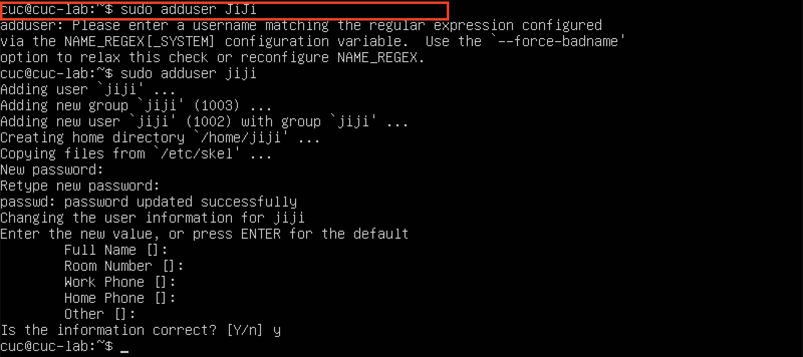
    - 给用户赋予sudo执行权限
        ```bash
        sudo usermod -G sudo username 
        ```
        验证`sudo`权限

        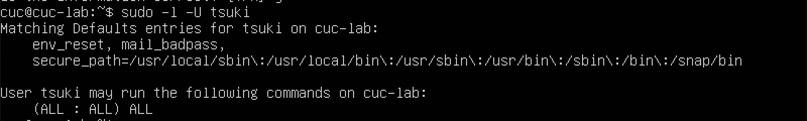
<br>

* 如何将一个用户添加到一个用户组?
    - 先创建一个新的用户组，然后输入命令将用户添加到用户组
        ```bash
        usermod -a -G 组名 用户名
        ```
<br>

* 如何查看当前系统的分区表和文件系统详细信息?
    - 输入如下命令
        ```bash
        sudo lsblk
        ```
        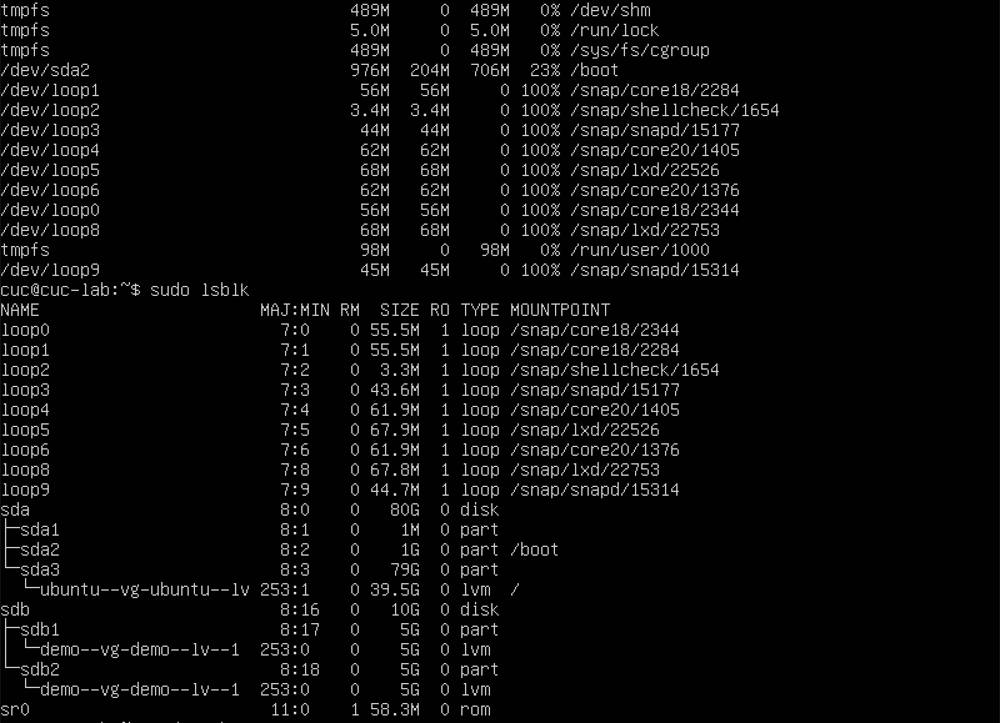
<br>

* 如何实现开机自动挂载Virtualbox的共享目录分区?
    - 首先在设置中配置好需要共享的文件
        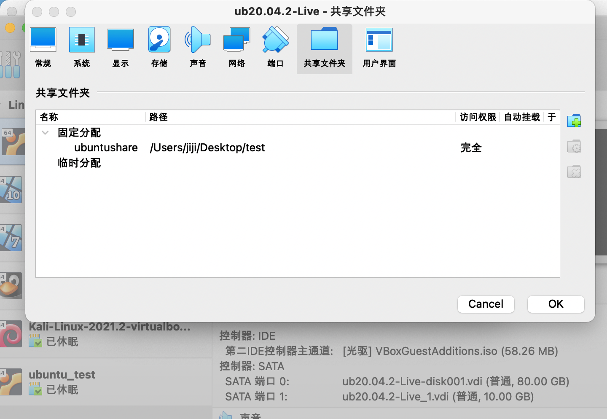
    - 然后在终端新建文件夹
        ```bash
        sudo mkdir /mnt/sharedfile
        ```
    - 进行挂载命令
        ```bash
        sudo mount -t vboxsf ubuntushare /mnt/sharedfile/
        ```
    - 编辑`/etc/fstab`文件，将如下命令添加，实现每次开机自动挂载
        ```bash
        ubuntushare 
        ```
        
        关于共享文件自动挂载的修正：
        [](https://asciinema.org/a/Myh146kBAB5DT36B3RBwWtkW4)

* 基于LVM(逻辑分卷管理)的分区如何实现动态扩容和缩减容量?
    - 按照操作步骤设置好LVM分区
        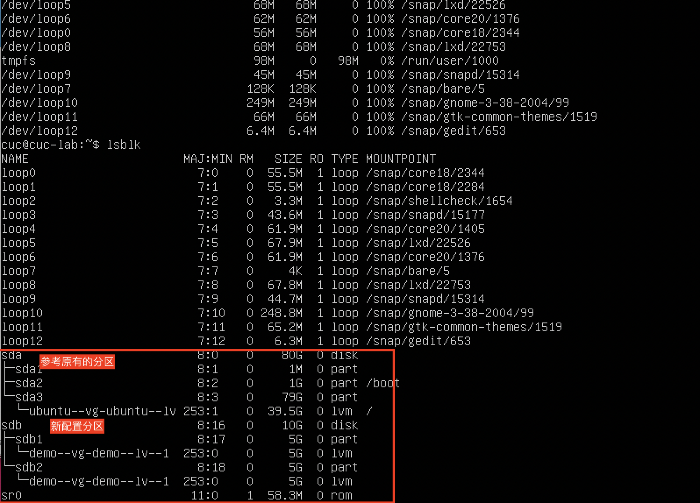
        动态扩容
        ```bash
        lvextend -L +容量 分区路径
        ```
        动态缩减
        ```bash
        lvreduce -L -容量 分区路径
        ```
        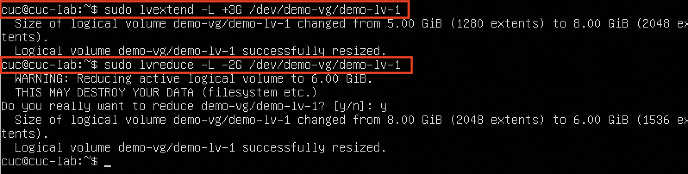
<br>

* 如何通过systemd设置实现在网络连通时运行一个指定脚本,在网络断开时运行另一个脚本?
    - 首先编写了两个简单的脚本`check.sh`和`stop.sh`作为测试
    - 然后编辑配置文件
        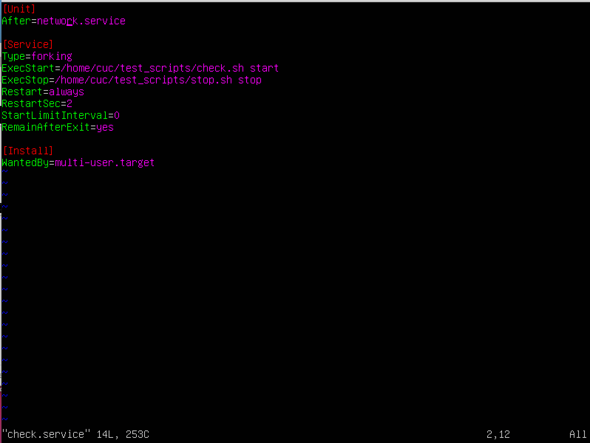
    - 检验
        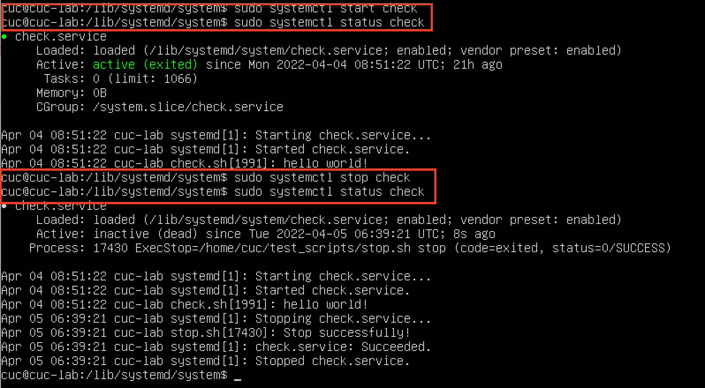
<br>

* 如何通过systemd设置实现一个脚本在任何情况下被杀死之后会立即重新启动?实现 ***杀不死？***
    - 重新编辑服务配置文件，在文件中添加如下内容
        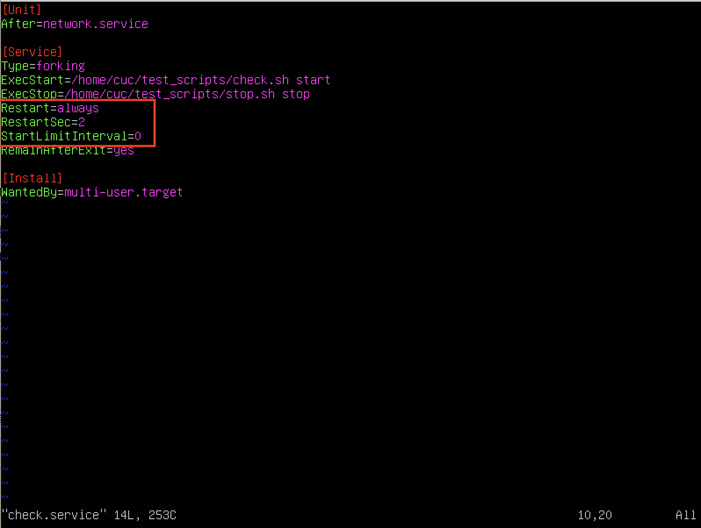
    - 修改配置文件后重启，验证是否实现
        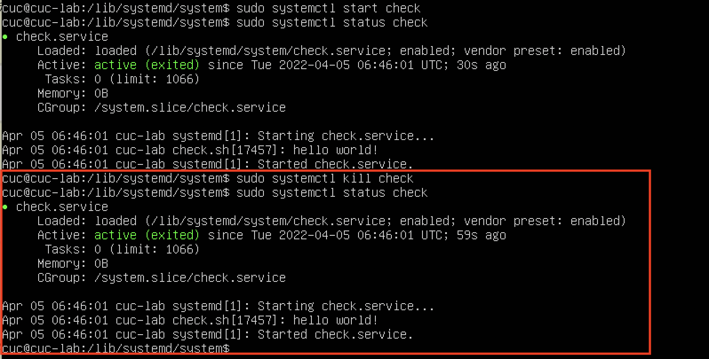


### 遇到的问题
* 如何实现开机自动挂载Virtualbox的共享目录分区?
    - 遇到的问题1:在输入挂载命令
        ```bash
        sudo mount -t vboxsf ubuntushare /mnt/sharedfile/
        ```
        时出现报错：**'ubuntushare' is not a valid block device**
    <br>
    - 解决办法：在搜索引擎搜索关键词“linux自动挂载 is not a valid block device”后参考文章[解决mount cifs时出现"is not a valid block device"的问题](https://blog.csdn.net/h952520296/article/details/82656074)，文章中提到可能是没有安装`mount.cifs`套件的原因，我代入我的问题后在终端输入`mount.vboxsf`果然未找到该命令。安装vboxsf后，问题解决，可以实现自动挂载。
<br>

* 如何通过systemd设置实现在网络连通时运行一个指定脚本,在网络断开时运行另一个脚本?
    - 遇到的问题1:编辑好配置文件后，执行命令
        ```bash
        sudo systemctl start check #check是我的配置文件名
        ```
        然后查看此时服务的状态，在active那一行显示的结果是：**inactive(dead)**。
    - 解决办法：仔细考虑，暂时认为是我编写的脚本文件过于简单，所以服务很快就执行完了，这个问题暂且先放一下。
    <br>
    - 遇到的问题2:结合问题1，发现还出现了一个问题，就是网络连通时运行的脚本运行结束后会自动调用网络断开时运行的另一个脚本。
    - 解决办法：参考文章
    [systemctl service失效，在start后自动调用stop (ExecStop)，排查分析及处理过程](https://blog.csdn.net/Peter_JJH/article/details/108446380)
    只需要在配置文件中添加`RemainAfterExit=yes`即可。
    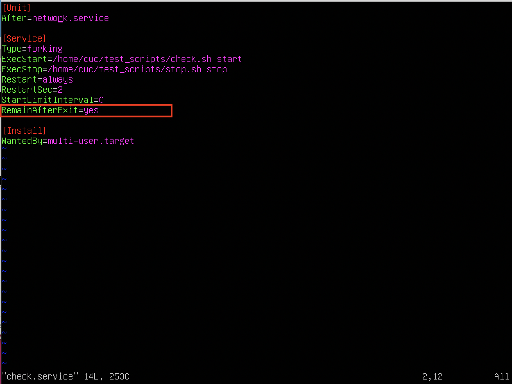

---
## 参考文献
* [Systemd入门教程:实战篇 by阮一峰的网络日志 ](https://www.ruanyifeng.com/blog/2016/03/systemd-tutorial-part-two.html)

* [Systemd入门教程：命令篇 by阮一峰的网络日志](https://www.ruanyifeng.com/blog/2016/03/systemd-tutorial-commands.html)

* [systemctl service失效，在start后自动调用stop (ExecStop)，排查分析及处理过程](https://blog.csdn.net/Peter_JJH/article/details/108446380)

* [解决mount cifs时出现"is not a valid block device"的问题](https://blog.csdn.net/h952520296/article/details/82656074)