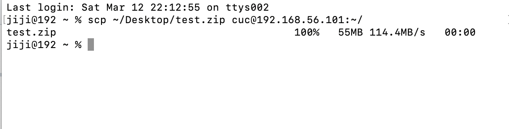

# 第二次作业

## abuntu
### 实验结果
* 【软件包管理】在目标发行版本上安装`tmux`和`tshark`:
  &nbsp;
    输入命令`sudo apt-get install tmux`和`sudo apt-get install tshar`即可安装tmux和tshark;
    <video id='video' controls='' preload='none' poster='asciinema-terminal cursor blink'>
    <source id='mp4' scr='https://asciinema.org/a/sqSemYpUtqsxqruZVA57gyd4I' type='video/mp4'>
    </video>
  &nbsp;
* 查看这2个软件被安装到哪些路径:
  &nbsp;
    输入命令`sudo find / -name tmux`和`sudo find / -name tshark`即可查询两个软件被安装的路径；
    <https://asciinema.org/a/nGEcHt8dECNhrT1EF6fnGtKqJ>
  &nbsp;
* 卸载`tshark`；验证`tshark`的卸载结果:
   &nbsp;
输入`sudo apt-get --purge remove tsahrk`即可卸载软件`tsahrk`，输入`dpkg -L tshark`得到结果`package 'tshark' is not installed`表明`tshark`已经被卸载
    <https://asciinema.org/a/W1cEMbZ43igXKWXTIKHpJDQ5h>
  &nbsp;
* 【文件管理】复制以下shell代码到终端运行，在目标Linux发行版本系统中构造测试数据集，然后回答以下问题：
  * 找到`/tmp`目录及其所有子目录下，文件名包含`666`的所有文件
  * 找到`/tmp`目录及其所有子目录下，文件内容包含`666`的所有文件
    <https://asciinema.org/a/8onOeJxZNkEf0NXpu6rucsXTL>
  &nbsp;
* 【文件压缩与解压缩】练习课件中文件压缩与解压缩一节所有提到的压缩与解压缩命令的使用方法
  * .zip文件:
    ```bash
        unzip filename.zip  #解压
        zip filename  #压缩
    ```
    解压:
      1. 首先用scp把压缩文件test.zip传输到虚拟机中
         
      2. 输入命令`ls -l`查看是否传输成功；验证虚拟机中已经包含test.zip压缩包后，输入命令`sudo apt-get install unzip`下载并安装`unzip`，然后输入命令`unzip test.zip`
        <https://asciinema.org/a/HVvmNEdxXgKqzzzrVk0D8cVjw>

    压缩:
      1. 输入命令`zip PPT.pptx`将文件PPT.pptx进行压缩，然后用`ls -l`列出所有文件，验证PPT.pptx是否压缩成功
        <https://asciinema.org/a/bUq17dFLbawNCtf308y7p6X6p>
  &nbsp;
  * .tar文件：
    ```
        tar -xvf filename.tar  #解压
        tar -cvf filename.tar  #压缩
    ```
    <https://asciinema.org/a/Rew4YItPOqIz0kcAZnKBJdeqG>
    <https://asciinema.org/a/Rew4YItPOqIz0kcAZnKBJdeqG>
  &nbsp;

  * .gzip文件
    ```bash
        gzip filename  #压缩
        gzip -r dirname/  #批量压缩
        gzip -d filename.gz  #解压
    ```
    <https://asciinema.org/a/zOZ0SpZAM5pwRgGp0TGHupaMf>

  &nbsp;
  


* 【跟踪】子进程管理实验
    <https://asciinema.org/a/G1LwuolzohK8MGcIihzkTegxf>
 
  &nbsp;

* 【硬件信息获取】目标系统的CPU、内存大小、硬盘数量和硬盘容量
 &nbsp;
    CPU：
    ```bash
        cat /proc/cpuinfo  #查询得到cpu的所有信息
        cat /proc/meminfo  #查询cpu内存大小的详细信息
    ```
    内存大小：
    ```bash
        cat /proc/meminfo  #查询cpu内存大小的详细信息
        free -m  #查询内存大小
    ```
    硬盘数量和硬盘容量：
    ```bash
        sudo fdisk -l |grep Disk  #查看硬盘的数量和硬盘容量
    ```
    <https://asciinema.org/a/h7UQoTJIedI9SwKRmim2lqv2Z>
  